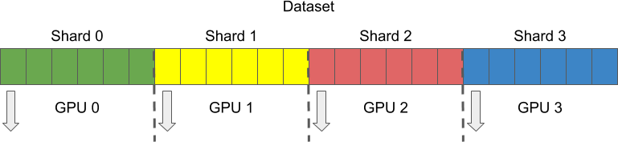

# ⚡️V-SWIFT: Training a Small VideoMAE Model on a Single Machine in a Day

## ☀️ Ours Meathod Details

| ViT-B/16              | VideoMAEv1       | VideoMAEv2       |  V-SWIFT        |  V-SWIFT        |  V-SWIFT        |
| :---------            | :--------------: | :--------------: | :-------------: | :-------------: | :-------------: |
| **Hardware**          |  **64 × A100**   |  **64 × A100**   |   **8 × A100**  |   **8 × H800**  |   **8 × H20**   |
| Dataset               |      SSV2        |      SSV2        |    SSV2         |    SSV2         |    SSV2         |
| Pretrain epoch        |      1200        |      1200        |    1200         |    1200         |    1200         |
| Model FLOPs           |    54.157(×2)    |    35.305(×2)    |   53.433G(×2)   |    53.433G(×2)  |   53.433G(×2)   |
| Pretrain time         |     ~28.4(h)     |     ~15.9(h)     |    ~25(h)       |    ~12.1(h)     |   ~23.3(h)      |
| **GPU × hour**        |  **1817.6**      |  **1017.6**      |    **200**      |    **96.8**     |    **186.4**    |
|  **Speedup**          |      -           |      1.79×       |   **9.09×**     |    **18.8×**    |    **9.78×**    |
|  **kg CO2eq.**        |     **314.08**   |**175.84(-43.9%)**|**34.56(-89.0%)**|    -            |    -            |
| Use flash-attn        |      no          |      no          |    yes          |    yes          |    yes          |
| GPU dtype             |   float16        |      float16     |    bfloat16     |    bfloat16     |    bfloat16     |
| Dataloader utility    |    Pytorch       |    Pytorch       |    DALI         |    DALI         |    DALI         |
| BatchSize per GPU     |      32          |      32          |    256          |    256          |    256          |
| Global BatchSize      |    2048          |      2048        |    2048         |    2048         |    2048         |
| GPU memory            |      -           |      -           |    ~71.8G       |   ~71.8G        |   ~74.0G        |
| Dataset mount         |  PetrelBackend   | PetrelBackend    |    RAM          |    SSD          |    RAM          |
| CPU BogoMIPS          |      -           |      -           |    5800.00      |    4000.00      |    5200.30      |
| CPU GHz               |      -           |      -           |    0.8-3.5GHz   |    2.0-4.0GHz   |   1.5-2.6GHz    |
| CPU threads           |      -           |      -           |     128         |      200        |       384       |
| Dataloader processes  |      -           |      -           |   90%(~14*8)    |  90%(~20*8)     |  90%(~38*8)     |
| Videos/sec/gpu        |     ~30.79       |     ~55.01       |    ~279.89      |   ~331.84       |   ~300.6        |
| **MFU**               |     **~3.2%**    |      **~3.7%**   |    **~28.7%**   |   **~10.7%**    |   **~65.1%**    |
| Finetune test top1    |      70.28       |      70.15       |    69.96        |     -           |     -           |


* The SSV2(Something-SomethingV2) dataset consists of webm-files that use the VP9 codec and have a resolution height of 240 pixels.

* model details: `num_frames=16` `input_size=224` `tubelet_size=2`.

* During Fine-tuning testing, the top-1 accuracy is assessed using the parameters `test_tta_num_segment=2` and `test_tta_num_crop=3`

* We compare trainingtime (GPU·hours), total carbon emission (kg CO2eq.) estimated using [ML CO2 Impact](https://mlco2.github.io/impact/#compute).

* A100(80GB SXM) BFLOAT16/FP16 Tensor Core is 312.0 TFLOPS per second.

* H800(80GB SXM) BFLOAT16/FP16 Tensor Core is 989.5 TFLOPS per second.

* H20(96GB SXM) BFLOAT16/FP16 Tensor Core is 148.0 TFLOPS per second.

* The calculation of FLOPs is performed using the `FlopCountAnalysis` function from the `fvcore` library.

* MFU = (3 * flops_model) * throughput_videos_sec / (gpu_num * GPU_AVAILABLE_FLOPS)

* [PetrelBackend](https://mmengine.readthedocs.io/zh-cn/stable/api/generated/mmengine.fileio.PetrelBackend.html) for OpenGVLab internal usage.

* If you find that your training speed is the io bottleneck, you can mount dataset to RAM, using the following command. If your RAM has 300G, `sudo mkdir /train_tmp` and `mount -t tmpfs -o size=200G  tmpfs /train_tmp`.

## 💗 Updates

- `2024.12`: The code of V-SWIFT are released.

## 🏠 Model Architecture Details

V-SWIFT pretrain-pixel (mask_ratio=0.9, frame × input_size=16×224×224)

| Name | Parameters | FLOPs            | en_Width | en_Depth | en_MLP | en_mlp_ratio | en_Heads | de_Width | de_Depth | de_Heads |
|------|----------- |------------------|----------|----------|--------|--------------|----------|----------|----------|----------|
| S/16 |  25.808M   |    17.929G       | 384      | 12       | 1536   | 4.0          | 6        | 192      | 4        | 3        |
| B/16 |  0.101G    |    53.433G       | 768      | 12       | 3072   | 4.0          | 12       | 384      | 4        | 6        |
| L/16 |  0.33G     |    0.11T         | 1024     | 24       | 4096   | 4.0          | 16       | 512      | 4        | 8        |
| H/16 |  0.658G    |    0.162T        | 1280     | 32       | 5120   | 4.0          | 16       | 512      | 4        | 8        |
| g/14 |  1.04G     |    0.3T          | 1408     | 40       | 6144   | 48/11        | 16       | 512      | 4        | 8        |

* The calculation of FLOPs and Parameters is conducted using the `FlopCountAnalysis` function from the `fvcore` library.

## 🔨 Installation
 
```bash
apt-get install -y ffmpeg libavcodec-dev libavfilter-dev libavformat-dev libavutil-dev

conda create --name videomae python=3.10 -y
conda activate videomae
conda install pytorch torchvision torchaudio pytorch-cuda=12.1 -c pytorch -c nvidia
pip install decord==0.6.0
pip install nvidia-dali-cuda120==1.44.0
pip install timm==0.4.12
pip install tensorboardX==2.6.2.2
pip install SciPy==1.11.4
pip install matplotlib
pip install scikit-image==0.24.0
pip install deepspeed==0.16.1
pip install flash-attn==2.7.2
pip install psutil==6.0.0
pip install opencv-python
```

## ✏️ Data Preparation


1. Download [Kinetics-400 videos](https://github.com/cvdfoundation/kinetics-dataset) (~153GB)

2. Download [Something-SomethingV2 videos](https://www.qualcomm.com/developer/software/something-something-v-2-dataset) (~17GB)

3. Download [InternVid10M videos](https://github.com/OpenGVLab/InternVideo/tree/main/Data/InternVid) (~4TB)

4. Download [Kinetics-600 videos](https://github.com/cvdfoundation/kinetics-dataset) (~271GB) and Download [Kinetics-700 videos](https://github.com/cvdfoundation/kinetics-dataset) (~392GB)

5. For [Kinetics-710 videos](https://github.com/OpenGVLab/UniFormerV2/blob/main/DATASET.md), `UniFormerV2` merge the training set of Kinetics-400/600/700, and then delete the repeated videos according to Youtube IDs. As a result, the total number of training videos is reduced from 1.14M to 0.65M.

6. Scale-up Preprocess: For `InternVid10M` and `Kinetics-710`, we cut each video into 3-second-long chunks (without overlap) and resize the smaller size to 256 pixels for faster throughput.

7. `Pretrain` Please select the appropriate solution based on your actual storage situation and carefully read and understand the documentation within the code before implementation. 

      a. Large-Scale Storage Solution:
      If your computing cluster has ample storage space, we recommend using the `num_shards=world_size` and `shard_id=rank` method for data storage. Ensure that each machine loads every piece of data from the entire dataset.

      

      b. Solution for Limited Storage Space:
      Should your storage space be constrained, we suggest splitting the data to ensure that video data is evenly distributed across each machine. You can set `gpus_not_equal_num_shards` and `set_max_sample="estimated max_sample of the pretrain dataset"` for data storage. To maintain consistent data volume on each machine, if discrepancies are found, we will calculate the maximum data volume (maximum) and perform resampling on machines that do not meet this volume to ensure even data distribution.

## 🚗 Citation

If you find this repository useful, please use the following BibTeX entry for citation.

```latex
@misc{deepglint_vswift2024,
      title={V-SWIFT: Training a Small VideoMAE Model on a Single Machine in a Day}, 
      url={ https://github.com/deepglint/V-SWIFT },
      author={Yang, Ninghua and An, Xiang and Yang, Kaicheng, Xie, Yin and Dai, Xiangzi, Deng, Jiankang and Feng, Ziyong},
      publisher={DeepGlint},
      year={2024}
}
```

## 👀 Acknowledgement

This repository is built based on [DALI](https://github.com/NVIDIA/DALI), [VideoMAE](https://github.com/MCG-NJU/VideoMAE), [VideoMAEv2](https://github.com/OpenGVLab/VideoMAEv2),  [AVION](https://github.com/zhaoyue-zephyrus/AVION), [LaViLa](https://github.com/facebookresearch/LaViLa), [mae](https://github.com/facebookresearch/mae), [mae_st](https://github.com/facebookresearch/mae_st), [ffcv](https://github.com/libffcv/ffcv), [decord](https://github.com/dmlc/decord) and [InternVideo](https://github.com/OpenGVLab/InternVideo) repository.

## 📚 License
[MIT License](./LICENSE).
